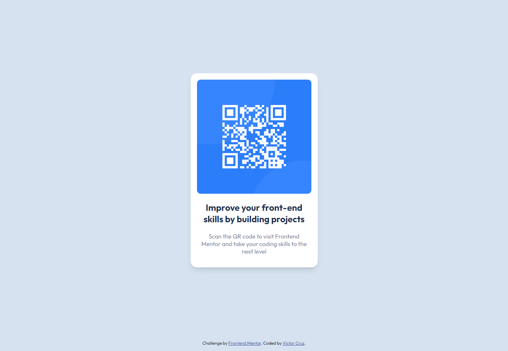

# Frontend Mentor - QR code component solution

This is a solution to the [QR code component challenge on Frontend Mentor](https://www.frontendmentor.io/challenges/qr-code-component-iux_sIO_H). Frontend Mentor challenges help you improve your coding skills by building realistic projects. 

## Table of contents

- [Frontend Mentor - QR code component solution](#frontend-mentor---qr-code-component-solution)
  - [Table of contents](#table-of-contents)
  - [Overview](#overview)
    - [Screenshot](#screenshot)
    - [Links](#links)
  - [My process](#my-process)
    - [Built with](#built-with)
    - [What I learned](#what-i-learned)
  - [Author](#author)

## Overview

### Screenshot



### Links

- Solution URL: [https://github.com/ikreuz](https://github.com/ikreuz/frontendmentor-qr-code-component.git)
- Live Site URL: [https://vigilant-euclid-7deca0.netlify.app](https://vigilant-euclid-7deca0.netlify.app/)

## My process

### Built with

- Semantic HTML5 markup
- CSS custom properties
- Flexbox

### What I learned

I consider that I learned how to design a component, based on certain predefined requirements. I consider that these challenges are important, since instead of a component you can think of a web page that must be designed following this learning vector.

I establish a container as the main structure

```html
 <div class="container"></div>
```

followed by a main content with main tag

```html
 <main class="main-content" role="main"></main>
```

and finally a letter with tag article

```html
<article class="card" role="article"></article>
```


## Author

- Website - [Victor Cruz](https://github.com/ikreuz/)
- Frontend Mentor - [@ikreuz](https://www.frontendmentor.io/profile/ikreuz)
